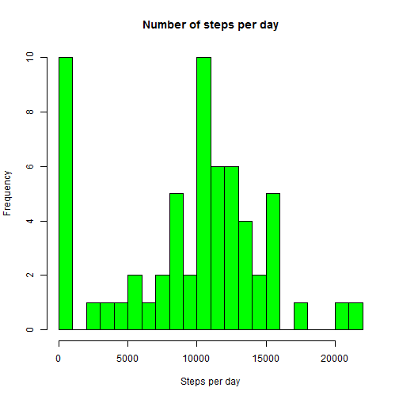
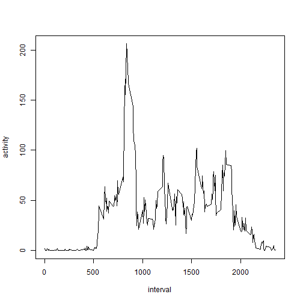
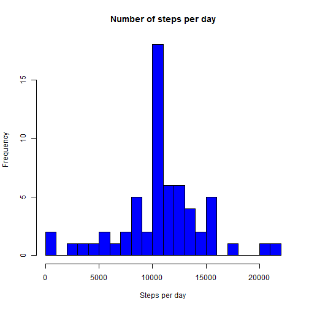

## Loading and preprocessing the data
The data for this assignment avaible the course web site: 

Dataset: [Activity monitoring data](https://d396qusza40orc.cloudfront.net/repdata%2Fdata%2Factivity.zip)

The variables included in this dataset are:

- steps: Number of steps taking in a 5-minute interval (missing values are coded as NA)

- date: The date on which the measurement was taken in YYYY-MM-DD format

- interval: Identifier for the 5-minute interval in which measurement was taken

The dataset is stored in a comma-separated-value (CSV) file and there are a total of 17,568 observations in this dataset.

```r
library(dplyr)
```

```
## Warning: package 'dplyr' was built under R version 3.2.2
```

```
## 
## Attaching package: 'dplyr'
## 
## —ледующие объекты скрыты от 'package:stats':
## 
##     filter, lag
## 
## —ледующие объекты скрыты от 'package:base':
## 
##     intersect, setdiff, setequal, union
```

```r
data <- read.csv('activity.csv')
head(data)
```

```
##   steps       date interval
## 1    NA 2012-10-01        0
## 2    NA 2012-10-01        5
## 3    NA 2012-10-01       10
## 4    NA 2012-10-01       15
## 5    NA 2012-10-01       20
## 6    NA 2012-10-01       25
```

```r
str(data)
```

```
## 'data.frame':	17568 obs. of  3 variables:
##  $ steps   : int  NA NA NA NA NA NA NA NA NA NA ...
##  $ date    : Factor w/ 61 levels "2012-10-01","2012-10-02",..: 1 1 1 1 1 1 1 1 1 1 ...
##  $ interval: int  0 5 10 15 20 25 30 35 40 45 ...
```

## What is mean total number of steps taken per day?
For this part of the assignment, you can ignore the missing values in the dataset.

1. Calculate the total number of steps taken per day


```r
data <- group_by(data, date)
activity <- summarize(data, total_steps = sum(steps, na.rm=TRUE))
```

2. Make a histogram of the total number of steps taken each day


```r
hist(activity$total_steps, breaks=20, col="green", main="Number of steps per day", xlab="Steps per day")
```

 

3. Calculate and report the mean and median of the total number of steps taken per day


```r
mean(activity$total_steps)
```

```
## [1] 9354.23
```

```r
median(activity$total_steps)
```

```
## [1] 10395
```

## What is the average daily activity pattern?
1. Make a time series plot (i.e. type = "l") of the 5-minute interval (x-axis) and the average number of steps taken, averaged across all days (y-axis)


```r
data <- group_by(data, interval)
interval_plot <- summarize(data, activity = mean(steps, na.rm=TRUE))
plot(interval_plot, type = "l")
```

 

2. Which 5-minute interval, on average across all the days in the dataset, contains the maximum number of steps?


```r
interval <- summarize(data, total_steps = sum(steps, na.rm=TRUE), activity = mean(steps, na.rm=TRUE))
interval$interval[which.max(interval$total_steps)]
```

```
## [1] 835
```


## Imputing missing values
Note that there are a number of days/intervals where there are missing values (coded as NA). The presence of missing days may introduce bias into some calculations or summaries of the data.

1. Calculate and report the total number of missing values in the dataset (i.e. the total number of rows with NAs)


```r
sum(is.na(data))
```

```
## [1] 2304
```

2. Devise a strategy for filling in all of the missing values in the dataset. The strategy does not need to be sophisticated. For example, you could use the mean/median for that day, or the mean for that 5-minute interval, etc.

**Used mean of steps for a day.**

3. Create a new dataset that is equal to the original dataset but with the missing data filled in.


```r
data[is.na(data)] = mean(data$steps, na.rm=TRUE)
data <- group_by(data, date)
filled <- summarize(data, total_steps = sum(steps, na.rm=TRUE))
```

4. Make a histogram of the total number of steps taken each day and Calculate and report the mean and median total number of steps taken per day. Do these values differ from the estimates from the first part of the assignment? What is the impact of imputing missing data on the estimates of the total daily number of steps?


```r
hist(filled$total_steps, breaks=20, col = "blue", main = "Number of steps per day", xlab = "Steps per day")
```

 

```r
mean(filled$total_steps)
```

```
## [1] 10766.19
```

```r
median(filled$total_steps)
```

```
## [1] 10766.19
```

**Values are differ from the estimates from the first part of the assignment. Impact of imputing missing data on the estimates of the total daily number of steps is rather low.**

## Are there differences in activity patterns between weekdays and weekends?
For this part the weekdays() function may be of some help here. Use the dataset with the filled-in missing values for this part.

```r
# new initialisation
data <- read.csv("activity.csv")
data$date <- as.Date(data$date)
data <- mutate(data, weekdays = weekdays(data$date))
```

1. Create a new factor variable in the dataset with two levels Ц УweekdayФ and УweekendФ indicating whether a given date is a weekday or weekend day.


```r
data$weekdays[data$weekdays=="понедельник"]<-"Weekday"
data$weekdays[data$weekdays=="вторник"]<-"Weekday"
data$weekdays[data$weekdays=="среда"]<-"Weekday"
data$weekdays[data$weekdays=="четверг"]<-"Weekday"
data$weekdays[data$weekdays=="п€тница"]<-"Weekday"
data$weekdays[data$weekdays=="суббота"]<-"Weekend"
data$weekdays[data$weekdays=="воскресенье"]<-"Weekend"
data <- group_by(data, interval, weekdays)
```

2. Make a panel plot containing a time series plot (i.e. type = "l") of the 5-minute interval (x-axis) and the average number of steps taken, averaged across all weekday days or weekend days (y-axis). See the README file in the GitHub repository to see an example of what this plot should look like using simulated data.


```r
# for weekday
weekday <- subset(data, data$weekdays=="Weekday")
weekday <- group_by(weekday, interval)
summary_weekday <- summarize(weekday, activity = mean(steps, na.rm = TRUE))
# for weekend
weekend <- subset(data, data$weekdays=="Weekend")
weekend <- group_by(weekend, interval)
summary_weekend <- summarize(weekend, activity = mean(steps, na.rm = TRUE))
par(mfrow=c(2, 1), mfg = c(1, 1), cex = 0.7, pty = "m")  
# drawing
plot(summary_weekday, type="l", main="Weekday")
plot(summary_weekend, type="l", main="Weekend")
```

 
